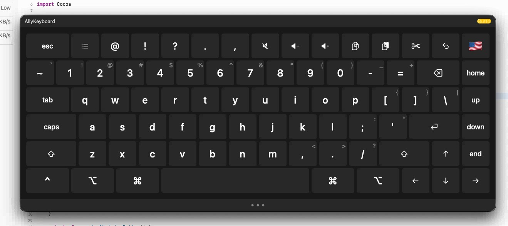

# AllyKeyboard

A floating virtual keyboard for macOS with improved usability, designed for head tracker users.



## What it is

AllyKeyboard is a clickable on-screen keyboard that stays on top of all windows. It lets users who rely on a headmouse or similar pointing device type without a physical keyboard. Inspired by Hot Virtual Keyboard on Windows, built natively for macOS.

## Features

- Floating window that stays above all other apps
- Full QWERTY layout with modifier keys (Shift, Ctrl, Alt, Cmd)
- Number row with symbol variants
- Media and function keys (mute, volume, cut, copy, paste, undo)
- Navigation keys (Home, End, Up, Down, Left, Right)
- Caps Lock, Tab, Escape
- Language switcher
- Dark appearance

## Tech stack

- Swift / AppKit (no SwiftUI)
- CGEvent for cross-process key simulation
- Accessibility API (AXUIElement)
- `NSWindow.level = .floating` for always-on-top behaviour

## Status

Work in progress — personal use project, not distributed via the App Store.

## Development

```bash
cd AllyKeyboard
xcodebuild -scheme AllyKeyboard -configuration Debug build
```

The project targets macOS and requires Accessibility permissions to simulate keystrokes in other applications. App Sandbox is disabled (required for CGEvent cross-process input).
