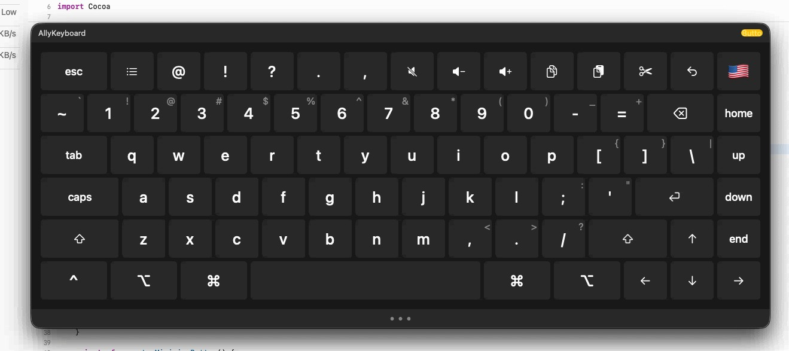

# AllyKeyboard

[](https://github.com/umkasanki/ally-keyboard/actions/workflows/core-tests.yml)
[](https://github.com/umkasanki/ally-keyboard/releases/latest)

A floating virtual keyboard for macOS with improved usability, designed for head-tracker / headmouse users.



## What it is

AllyKeyboard is a clickable on-screen keyboard that stays on top of all windows. It lets users who rely on a headmouse or similar pointing device type without a physical keyboard — every key is a large click target, and it never steals focus from the app you're typing into. Inspired by Hot Virtual Keyboard on Windows, built natively for macOS.

## Features

- **Floating, non-activating** window — always on top, clicking keys doesn't steal focus.
- Full QWERTY + number row with symbol variants; **multilingual** layout switching (types and relabels per the active input source).
- **Modifier chords** — sticky Shift / Ctrl / Alt / Cmd (active keys highlight red).
- **Word prediction** — a docked balloon (above or below, wherever there's room) that also hosts your **saved phrases**; dismisses on outside click.
- **Right-hand action column** — copy / cut / paste / undo (Material icons) + **Translate** (opens the current selection in Google Translate).
- Fixed top-row punctuation and `+ − =` keys, navigation keys (Home/End/PgUp/PgDn/arrows), media/volume keys.
- **Floating launcher** when collapsed — draggable, remembers its position, adjustable width/opacity.
- **Settings** — keyboard size (%), top/bottom bar heights (+ hide bottom bar), suggestions toggle & saved-phrase editor, launcher width/opacity, launch-at-login, launch-collapsed, and two dark themes (custom / macOS system colors).
- Dimmed function keys that brighten on hover/press, pointing-hand cursor, menu-bar + right-click control, runs as a **menu-bar accessory** (no Dock icon).

## Install

Download the latest build from the [**Releases**](https://github.com/umkasanki/ally-keyboard/releases/latest) page:

- **`AllyKeyboard-x.y.z.dmg`** — open it and drag `AllyKeyboard.app` into **Applications**, or
- **`AllyKeyboard-x.y.z.zip`** — unzip and move `AllyKeyboard.app` into **Applications**.

Then:

1. Launch AllyKeyboard. Grant **Accessibility** permission when prompted (System Settings → Privacy & Security → Accessibility) — it's required to send keystrokes to other apps.
2. Control it from the **menu-bar icon** (left-click show/hide, right-click menu) or the floating launcher.

> The build is **self-signed, not notarized** (personal-use project). On first launch macOS Gatekeeper will warn — **right-click the app → Open → Open**, then it runs normally.

## Build from source

Requires Xcode on macOS.

```bash
git clone https://github.com/umkasanki/ally-keyboard.git
cd ally-keyboard
xcodebuild -project AllyKeyboard/AllyKeyboard.xcodeproj -scheme AllyKeyboard -configuration Release build
```

To keep the Accessibility grant stable across rebuilds, sign with a dedicated self-signed identity — see [`AllyKeyboard/setup-signing.sh`](AllyKeyboard/setup-signing.sh) and [`AllyKeyboard/build-signed.sh`](AllyKeyboard/build-signed.sh).

## Tech stack

- Swift / AppKit (no SwiftUI)
- CGEvent for cross-process key simulation
- Accessibility API (AXUIElement); Text Input Source Services for layout-aware typing
- Non-activating `NSPanel` for the always-on-top, focus-preserving window

## AllyKeyboardCore

Platform-independent domain logic lives in the [`AllyKeyboardCore`](AllyKeyboardCore) Swift
package — no AppKit dependency, so it builds and is unit-tested on Linux (CI) as well as macOS:

- `TextTracker` — tracks the word currently being typed
- `PredictionEngine` — protocol for word completion; `DictionaryPredictionEngine` is the
  portable implementation (a `NSSpellChecker` adapter plugs in on macOS)
- `SuggestionApplier` — computes the minimal keystrokes to replace a partial word with a suggestion
- `Settings` / `SettingsStore` — persisted, lenient-decoding settings model

```bash
cd AllyKeyboardCore && swift test
```

The macOS app links this package locally and supplies the AppKit UI and key simulation.

## Status

Personal-use project, not distributed via the App Store. See [`PLAN.md`](PLAN.md) for the roadmap.
